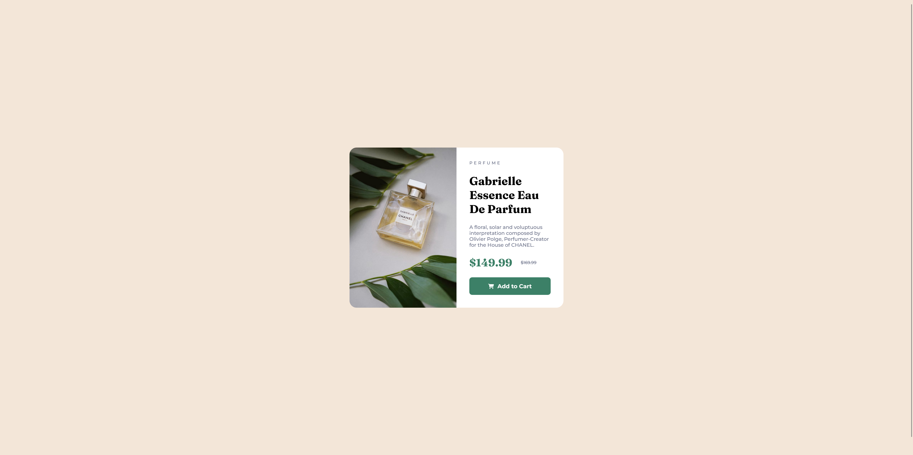
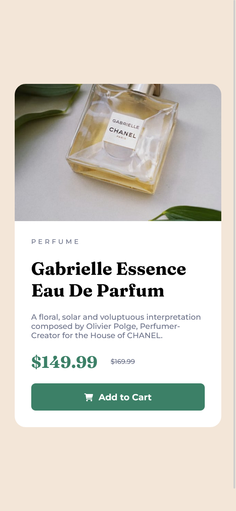

# 🛍️ Product Preview Card Component

Repositório dedicado ao exercício ["Product Preview Card Component"](https://www.frontendmentor.io/challenges/product-preview-card-component-GO7UmttRfa) do site [Frontend Mentor](https://www.frontendmentor.io).

## 🎯Desafio

"This HTML & CSS-only challenge will be perfect for anyone starting to build responsive projects."

*(Este desafio apenas em HTML e CSS será perfeito para quem está a começar a criar projectos responsivos.)*

### ⚒️ Tecnologias utilizadas 
- HTML5
- CSS3

### 🤩 Resultado

- [Confira aqui o resultado!](https://fem-vn-product-preview-card-component.netlify.app)

### 📸 Screenshots

  
Desktop:

  
  </img>
     

  
Mobile:

  
  </img>

